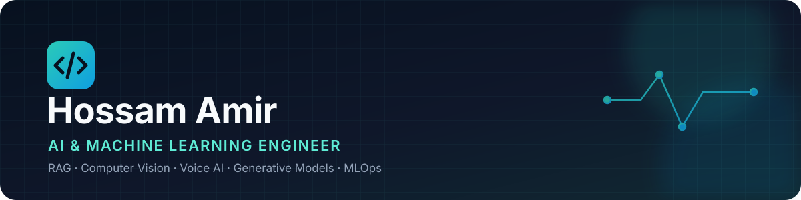

  

  

## About me

I am an **AI & Machine Learning Engineer** focused on turning experiments into tested, usable systems. My work spans retrieval-augmented generation, voice agents, computer vision, generative models, and practical MLOps.

- Building end-to-end AI applications across **RAG, voice AI, and computer vision**
- Developing and evaluating models with **PyTorch, TensorFlow, Hugging Face, and scikit-learn**
- Shipping reproducible work with **tests, Docker, GitHub Actions, MLflow, and Kaggle**
- Current focus: **production-ready LLM systems, efficient inference, and multimodal AI**

## Toolbox

  
  
  
  
  
  
  
  
  
  
  
  

## Selected work

| Project | What it demonstrates |
| --- | --- |
| [**AI Engineer Assessment**](https://github.com/7ossam-amir/electro-pi-ai-engineer-assessment) | LiveKit voice agent, FAISS/Ollama RAG, local model quantization, Dockerized inference, repeatable load tests, and unit testing. |
| [**Advanced Video Tracker**](https://github.com/7ossam-amir/Advanced_Video_Tracker_with_Threat_Analysis) | Flask application combining YOLO/OpenCV tracking, image descriptions, translation, and BERT-based threat analysis. |
| [**Medical Imaging: AE vs VAE**](https://github.com/7ossam-amir/AE_vs_VAE) | Modular TensorFlow comparison on Medical MNIST with reproducible metadata, visual evaluation, linting, and tests. |
| [**Conditional VAE Date Generator**](https://github.com/7ossam-amir/C_VAE) | PyTorch conditional generation with calendar-consistency objectives, strict validation, tests, Kaggle training, and a local UI. |
| [**MLOps GAN Pipeline**](https://github.com/7ossam-amir/MLOPS) | Configurable GAN training on Kaggle GPU with MLflow metrics, artifacts, and experiment tracking. |
| [**MLOps Quality Gate**](https://github.com/7ossam-amir/MLOPS_A5) | A lightweight scikit-learn pipeline with GitHub Actions, a measurable quality threshold, and a gated deploy job. |

## GitHub activity

  
  

## Let’s build something useful

I am interested in applied AI projects involving **RAG, computer vision, voice interfaces, generative models, and efficient deployment**. Explore my repositories or connect with me here on GitHub.

  Built around real project evidence—not a list of buzzwords.

