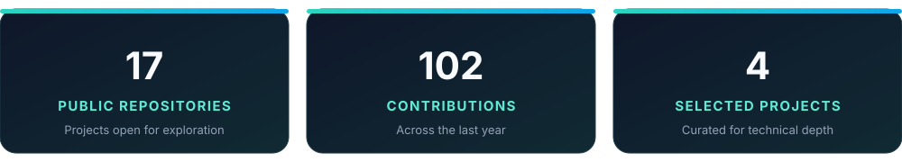

  

  

## About me

I am an **AI & Machine Learning Engineer** focused on turning experiments into tested, usable systems. My work spans retrieval-augmented generation, voice agents, computer vision, generative models, and practical MLOps.

- Building end-to-end AI applications across **RAG, voice AI, and computer vision**
- Developing and evaluating models with **PyTorch, TensorFlow, Hugging Face, and scikit-learn**
- Shipping reproducible work with **tests, Docker, GitHub Actions, MLflow, and Kaggle**
- Current focus: **production-ready LLM systems, efficient inference, and multimodal AI**

## Toolbox

  
  
  
  
  
  
  
  
  
  
  
  
  

## Selected work

| Project | Why it matters |
| --- | --- |
| **Multi-tenant AI Communication Platform** · Private case study | Production-oriented SaaS with isolated workspaces, a unified inbox, role-based access, AI-assisted replies, encrypted provider credentials, signed webhooks, durable storage, and multi-channel delivery. |
| [**AI Systems Engineering & Deployment**](https://github.com/7ossam-amir/electro-pi-ai-engineer-assessment) | A LiveKit voice agent, grounded FAISS/Ollama RAG, local model quantization, Dockerized inference, repeatable load testing, and a meaningful unit-test suite. |
| **Medical Form Intelligence Pipeline** · Private case study | Converts handwritten medical intake forms into structured records with template-aware regions, schema validation, confidence scoring, QA reports, and human-review flags. |
| [**Conditional Generative Modeling**](https://github.com/7ossam-amir/C_VAE) | A PyTorch conditional VAE with domain-consistency objectives, strict output validation, automated tests, Kaggle training, and a local generation interface. |

## GitHub activity

  

Profile snapshot · August 2026

## Let’s build something useful

I am interested in applied AI projects involving **RAG, computer vision, voice interfaces, generative models, and efficient deployment**. Explore my repositories or connect with me here on GitHub.

  Built around real project evidence—not a list of buzzwords.

